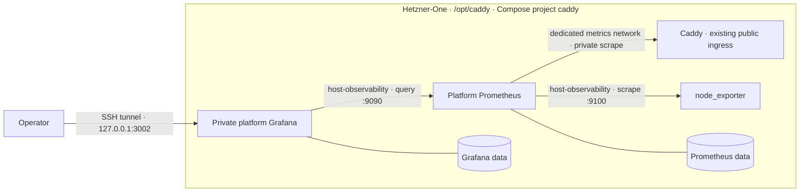

# Host and Caddy observability plan

## Status and scope

Planned, not deployed. This plan incorporates the former Caddy observability
proposal. Add a separate Hetzner-One Grafana, one platform Prometheus, and
node_exporter to observe the VPS and shared Caddy ingress.

Zibs and Hooklook retain their own Grafana servers, dashboards, provisioning,
credentials, Prometheus, Alloy, and Loki. This rollout does not scrape their
application metrics, collect their logs, or migrate their Grafana databases.
Collector centralization remains a separate, unscheduled decision.

Hetzner-One already owns shared ingress at `/opt/caddy`, with Compose project
name `caddy`. Keep that directory, project identity, both edge networks,
gallery mount, and external `zibs_caddy-*` certificate volumes. No repository
rename or Caddy directory cutover is required.

## Execution workflow

Prepare code, configuration, local validation, and updated deployment and
rollback runbooks first. Keep the user informed of decisions and results.
The user will execute VPS deployment and verification commands; provide
ordered commands with expected results and rollback steps, and review the
reported output before advancing the rollout. Do not deploy or run VPS
verification on the user's behalf.

## Objective

Hetzner-One owns:

- shared Caddy ingress and its bounded HTTP metrics;
- one node_exporter for VPS metrics;
- one platform Prometheus with `node` and `caddy` scrape jobs;
- one private platform Grafana with host and Caddy dashboards.

Host CPU, memory, load, filesystems, disk I/O, and network behavior belong to
the VPS platform. Caddy availability, traffic, upstream behavior, and edge
rejections belong alongside them. Both dashboards use a stable platform
Prometheus datasource UID so a later collector change need not rewrite panels.

Zibs's existing node_exporter remains unchanged. Duplicate host collection is
acceptable until its independent topology work is scheduled.

## Target topology

## Components and boundaries

| Component | Responsibility | Exposure |
| --- | --- | --- |
| node_exporter | Read-only host metrics | Private `host-observability` network; no published port |
| Platform Prometheus | Host and Caddy metrics, bounded retention | Private networks; no published query API |
| Platform Grafana | Host and Caddy dashboards | Host loopback `127.0.0.1:3002` only; SSH tunnel access |
| Caddy | Existing public ingress plus private HTTP metrics | Existing TCP 80/443 and UDP 443; metrics listener unpublished |

Caddy retains `zibs-edge` and `hooklook-edge` and joins a dedicated metrics
network shared only with platform Prometheus. It need not join
`host-observability`. A listener bound to all container interfaces is still
reachable by peers on Caddy's edge networks: neither Docker `expose` nor an
internal network is a per-port firewall. Document this trusted-container
boundary and verify reachability during implementation.

Grafana must support loopback host publication with its chosen network
attachments; verify this explicitly rather than assuming an internal-only
Docker network permits it. Disable anonymous access and signup, and never
proxy the platform workspace publicly. Use independent credentials and fresh
platform state, not a copy of either application's Grafana database.

Use Hetzner-One-owned named volumes with concise logical Compose keys and
stable deployed names. Inventory retained volumes and containers from the
reverted centralization experiment before choosing names; do not silently
reuse that state or delete recovery artifacts.

## Caddy signals and boundaries

- Enable Caddy's built-in HTTP metrics, including `per_host` for the configured
  sites. Scrape them from a dedicated, unpublished metrics handler/port, not
  from a network-exposed Caddy admin API. The default admin `/metrics` shares
  an API that can change live configuration; it currently listens only on
  container loopback. A private metrics handler is the safer Docker target.
- Measure scrape `up`, requests and status classes by configured host,
  durations, request and response sizes, and reverse-proxy behavior. Check
  actual metric labels from the pinned Caddy build before writing dashboard
  queries; middleware metrics can count one request at several handlers, so
  avoid summing all handler series as if they were unique requests.
- Verify experimentally that Caddy-generated `413` and `429` are visible in
  the chosen bounded metrics. HTTP parser rejection such as the `431` header
  boundary may happen before middleware metrics; retain a synthetic boundary
  check and use carefully scoped diagnostics if counters do not observe it.
- The pinned `caddy-ratelimit` module emits `zone,key` metrics and the current
  `key` is the direct client IP. **Disable the module's own metrics** unless
  its instrumentation is changed to export only zone aggregates. Dropping
  `key` later in Prometheus would still leave per-IP series in Caddy's registry
  and on the scrape response. Do not enable `log_key`.
- Keep the metrics endpoint off host ports 80/443 and out of every public
  Caddy route. Do not add raw URL, short code, bin code, client IP, or request
  body labels. Preserve Caddy's existing request limits and certificate state.

[Caddy's metrics guide](https://caddyserver.com/docs/metrics) describes the
built-in series and their multiple-handler behavior. The
[metrics directive](https://caddyserver.com/docs/caddyfile/directives/metrics)
supports a separate scrape path. The pinned module's
[metrics implementation](https://github.com/mholt/caddy-ratelimit/blob/5625512f24f6f59d6f64fb3aafe5eecff0b286db/metrics.go)
shows the per-key label that drives the restriction above.

## Repository preparation

1. Preserve the existing Caddy project, routes, limits, mounts, and networks.
2. Add private host-observability and Caddy scrape connectivity as above.
3. Add a pinned node_exporter with read-only `/`, `/proc`, and `/sys` views,
   correct host path flags, filesystem exclusions, capability drop,
   `no-new-privileges`, and no published port. Verify that metrics describe
   the host rather than the container.
4. Add one pinned Prometheus with only `node` and `caddy` jobs, a named volume,
   and bounded time and size retention. Budget WAL and compaction headroom.
5. Enable Caddy's built-in HTTP metrics and private handler while disabling
   the rate-limit module's per-client metrics. Validate with the pinned image.
6. Add pinned Grafana on `127.0.0.1:3002:3000`, independent secrets and state,
   one stable Prometheus datasource, and two provisioned dashboards.
7. The host dashboard covers exporter availability, CPU, memory, load, root
   filesystem capacity, disk throughput/latency, and non-loopback/non-Docker
   network traffic. The Caddy dashboard covers scrape health, site traffic,
   response classes, 4xx/5xx, latency, sizes, reverse-proxy indicators, and
   experimentally validated 413/429 signals.
8. Provide Caddy-only, observability-only, and full deployment modes, with
   explicit service selection and independent rollback. Observability-only
   updates must not recreate Caddy; initial metrics activation requires an
   intentional Caddy update. Avoid project-wide orphan removal.
9. Update deployment, diagnostics, SSH access, backup/restore, and rollback
   runbooks. Include Grafana runtime state and provisioned dashboard recovery.
10. Pin new image versions and verify publication age against the package-age
    policy before installing or pulling them.

Keep Caddy runtime logs available through `docker logs`. Access logs and
Loki ingestion are deferred until their fields, redaction, rotation, and
retention are defined. Exclude or redact raw paths, bin/short codes, client
IPs, headers, and bodies. A third Alloy/Loki pair is not required for this
rollout.

## Resource baseline and capacity

Read-only VPS snapshot on **2026-09-24** (`docker stats --no-stream`, `free -m`,
`docker system df`; low traffic, not a peak measurement):

| Current service group | Prometheus | Loki | Alloy | Sum of observed container memory |
| --- | ---: | ---: | ---: | ---: |
| Zibs | 34.19 MiB | 58.16 MiB | 72.10 MiB | 164.45 MiB |
| Hooklook | 51.29 MiB | 61.45 MiB | 41.95 MiB | 154.69 MiB |

The host has 3,819 MiB RAM, 2,499 MiB reported available, **no swap**, and
19 GiB free on `/`. Current telemetry volumes are small: zibs Prometheus
62.52 MB and Loki 421 kB; Hooklook Prometheus 3.111 MB and Loki 102.2 kB.
These are young, quiet deployments and do not predict retention-size growth.
Docker reports 10.13 GB of build cache; disk headroom must also preserve
Hooklook's documented 12 GB storage/backup allowance.

At this idle snapshot, a third complete collector trio would plausibly add
roughly **150–200 MiB of steady container memory** plus a third set of image,
WAL, volume, restart, and health-check overhead. This is an order-of-magnitude
comparison based on the two running trios, not a memory limit or peak
guarantee. CPU percentages below 0.5% per collector at one instant do not
predict CPU during bursts, compaction, or log ingestion. The two existing Grafanas used 148.7 and 152.8 MiB in this snapshot.
A separate platform Grafana and node_exporter add to the baseline; neither
application Grafana is being retired, so budget no consolidation savings.

The larger risk is **unbounded series or logs**, not the quiet baseline. The
rate-limit module's per-IP `key` could make Caddy and Prometheus memory and disk
grow with distinct client IPs, especially during abuse. Full access logs can
grow with request rate and contain sensitive paths. Prometheus retention-size
limits need WAL and compaction headroom beyond the nominal cap; see the
[Prometheus storage guidance](https://prometheus.io/docs/prometheus/latest/storage/).

**Decision for this rollout:** use one additional, bounded platform
Prometheus for both host and Caddy metrics, plus a separate platform Grafana. Defer a third Alloy/Loki unless a concrete
request-level diagnostic requirement appears. If full Caddy log ingestion is
later needed before collector consolidation, measure log rate under load and
set rotation, retention, and free-space thresholds first. The full trio is
feasible on the observed idle host, but adds complexity that the stated
health/traffic dashboard does not yet require.

## User-run production rollout and verification

1. Record `/opt/caddy` files, running images/modules/config, Compose resources,
   certificate volumes, and current public-route checks. Inventory loopback
   port 3002 and retained experimental resources before creating new state.
2. Refresh memory/disk measurements; the baseline above is historical. Check
   capacity for node_exporter, Prometheus, Grafana, retention, and backups.
3. Stage prepared files under `/opt/caddy` using the documented backup and
   activation procedure. Validate Compose, Prometheus configuration, and the
   candidate Caddyfile/image before modifying live services.
4. Start the observability services while existing Caddy serves traffic.
   Verify `up{job="node"} = 1`, host series, Grafana datasource health, and the
   host dashboard UID. A Caddy scrape failure is expected until activation.
5. Activate Caddy's metrics listener and network attachment, preserving public
   routes and certificates. A brief ingress outage is acceptable if recreation
   is needed. Avoid moving or replacing the Compose project.
6. Verify `up{job="caddy"} = 1`, actual labels, both dashboards, and bounded
   metric cardinality. Confirm no per-IP rate-limit series are exposed.
7. Exercise controlled 413/429 boundary checks and retain an independent 431
   check where middleware metrics cannot observe parser rejection. Do not
   repeatedly send large payloads or rate-limit bursts during routine deploys.
8. Verify zibs, its exact public dashboard URL and queries, Hooklook, and the
   gallery over HTTPS. External HTTPS checks establish end-to-end availability;
   Prometheus `up=1` establishes only scrape success.
9. Verify platform Grafana works through the SSH tunnel, requires login, and
   is inaccessible publicly. Confirm no public metrics/query route or port,
   and that Caddy's admin API remains on container loopback.
10. Retain prior configuration, images, and state through the rollback window.
    Record results and any observed resource change before accepting rollout.

## Rollback

If Caddy metrics affect ingress or resources, restore its prior Caddyfile,
Compose configuration, and image using the deployment runbook. Remove only
new metrics attachments as necessary; preserve both edge networks and external
certificate volumes. Recheck all public routes.

Stop only the platform observability services if needed; preserve their named
volumes for inspection and leave both application stacks untouched. Do not
use `docker compose down -v`. Restore Grafana state from a verified backup
when needed; do not substitute either application's database.

## Relationship to other work

- Hooklook and zibs observability remain independently deployed and owned.
- Zibs's later node_exporter removal and network segmentation belong to its
  own `docs/v2-topology-improvements.md`, outside this rollout.
- [Collector centralization](../docs/collector-centralization-plan.md) is an
  unapproved future proposal that needs revision for separate Grafana ownership.
  It does not supersede this plan or authorize application changes.
- The [current topology](../docs/topology.md) and
  [deployment runbook](../docs/deployment-runbook.md) describe live ingress;
  update them when implementation and user-run deployment change reality.

## Completion criteria

- Caddy and the private platform metrics stack deploy reproducibly in the
  documented modes, without changing application deployment ownership.
- Host and Caddy dashboards work through the SSH tunnel on port 3002.
- Host series, Caddy traffic, bounded rejection signals, and datasource health
  are verified; no application metrics or logs enter the platform stack.
- Public routes, the zibs shared dashboard, and certificate state are preserved.
- Private endpoint boundaries, retention, backup/restore, and rollback checks
  pass through user-run verification.
