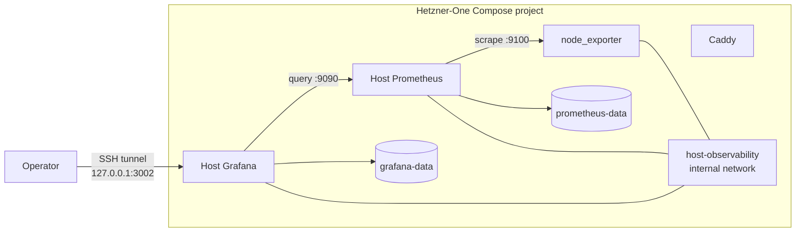

# Host observability plan

## Status

Deferred, independently deployable platform work. Hooklook application
observability does not depend on this plan and must not wait for it.

## Objective

Expand Caddy-One into a broader Hetzner-One platform project that owns:

- shared Caddy ingress;
- one node_exporter for VPS metrics;
- one host-only Prometheus;
- one private host Grafana workspace and dashboard.

The host stack observes the VM itself. It does not scrape zibs or Hooklook
application metrics, collect their logs, host their dashboards, or share its
Prometheus/Grafana with either application.

The current `Caddy-One` directory is not a Git working tree. Put the renamed
Hetzner-One project under version control before it becomes the source of truth
for additional persistent services.

## Motivation

Host CPU, memory, load, filesystems, disk I/O, and network behavior belong to
the VPS platform rather than to one application. A platform-owned collector
and dashboard provide a stable place for those signals as applications are
added, removed, or redeployed.

This project does not immediately eliminate zibs's existing node_exporter.
Until the separate zibs v2 topology work is scheduled, both collectors may
scrape the same host independently. The duplication is acceptable because it
keeps this rollout independent of changes to a working zibs deployment.

## Target topology

Caddy does not need to join `host-observability`. It remains responsible for
public ingress and its existing application-edge attachments. Host Grafana is
never proxied publicly.

## Components and boundaries

| Component | Responsibility | Exposure |
| --- | --- | --- |
| node_exporter | Read-only host CPU, memory, load, filesystem, disk, and network metrics | Internal `host-observability` network only |
| Host Prometheus | Scrape and retain node_exporter metrics | Internal `host-observability` network only |
| Host Grafana | Private host dashboard | `127.0.0.1:3002` only |
| Caddy | Existing shared TLS ingress | Public TCP 80/443 and UDP 443, unchanged |

Prometheus and Grafana use Hetzner-One-owned named volumes. Keep logical
Compose keys concise; the stable Compose project name supplies deployed
resource prefixes.

## Repository preparation

1. Rename Caddy-One to Hetzner-One and give the Compose project an explicit,
   stable name.
2. Keep the existing Caddy service, Caddyfile, gallery mount, zibs network
   attachment, and external `zibs_caddy-*` certificate volumes unchanged.
3. Add a private internal `host-observability` network.
4. Add the same pinned node_exporter version and read-only `/`, `/proc`, and
   `/sys` view already proven by zibs. Preserve its capability drop,
   `no-new-privileges`, filesystem exclusions, and lack of a published port.
5. Add a pinned Prometheus configured to scrape only `node-exporter:9100`.
6. Add a pinned Grafana published only as `127.0.0.1:3002:3000`, with signup
   and anonymous access disabled.
7. Provision one Prometheus datasource and one host dashboard covering:
   exporter availability, CPU, memory, load, root-filesystem capacity, disk
   throughput/latency, and non-loopback/non-Docker network traffic.
8. Add named volumes for Prometheus and Grafana state.
9. Add a deployment script, backup/restore instructions for Grafana state,
   bounded Prometheus retention, SSH-tunnel instructions, diagnostics, and
   rollback documentation.
10. Pin every new image version and apply the package-age policy before use.

## Verification

The platform smoke test must prove:

- node_exporter, Prometheus, and Grafana containers are running;
- `up{job="node"} = 1` in the host Prometheus;
- Grafana can query its provisioned Prometheus datasource;
- the expected host dashboard UID is provisioned;
- root-filesystem, CPU, memory, load, disk, and network series are present;
- Grafana is reachable on VM loopback port 3002 and is not publicly reachable;
- zibs, its public dashboard, the art gallery, and Caddy certificate handling
  remain unchanged.

## Production rollout

1. Record the current `/opt/caddy` files, Caddy image/modules/config, resource
   names, certificate volumes, and verification results.
2. Confirm VM memory and disk headroom for Prometheus and Grafana.
3. Sync the prepared project to `/opt/hetzner-one` without changing
   `/opt/caddy`.
4. Validate Compose and Caddy configuration in one-off containers.
5. Start node_exporter, host Prometheus, and host Grafana while the existing
   Caddy container continues serving traffic.
6. Verify the complete host metrics path and dashboard.
7. Stop the old Caddy container and start the Hetzner-One Caddy service in one
   short cutover, reusing the external certificate volumes.
8. Verify all existing Caddy routes and rerun the host smoke test.
9. Retain `/opt/caddy` unchanged through the rollback window.

## Rollback

Stop the Hetzner-One Caddy container and restart `/opt/caddy`. The host
observability services can either remain running or be stopped independently;
they do not own public ports or modify application state. Preserve their named
volumes until the rollout is either accepted or deliberately abandoned.

## Relationship to other work

- Hooklook application observability is independent and may be deployed before
  or after this plan.
- zibs remains unchanged here. Its later node_exporter removal and network
  segmentation are specified in
  the zibs repository's `docs/v2-topology-improvements.md`.
- Caddy changes required to route Hooklook belong to the Hooklook shipping
  work, not to this host-observability rollout.

## Completion criteria

- Hetzner-One is version-controlled and reproducibly deploys Caddy plus the
  private host metrics stack.
- The host dashboard works through an SSH tunnel to port 3002.
- No application sends metrics or logs to the host stack.
- Caddy behavior and all existing public routes are unchanged.
- Deployment, restart, backup/restore, and rollback checks pass.
