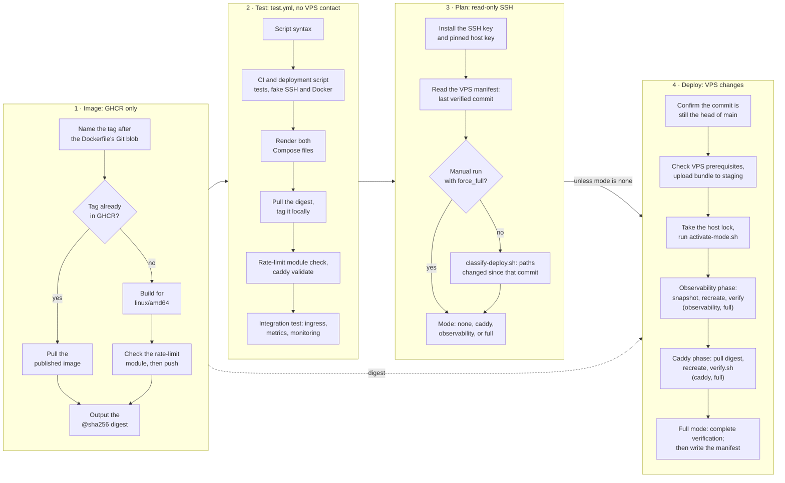

# Caddy deployment runbook

Pushes to `main` that change the Caddy or monitoring configuration deploy it
through the [`Deploy production`](../.github/workflows/deploy.yml) workflow.
GitHub Actions builds the Caddy image and publishes it to GHCR; the VPS pulls
the exact digest and never builds.
The workstation script `./scripts/deploy.sh` remains for the first
observability installation, Grafana password changes, and recovery. This
runbook assumes a prepared Docker VPS; it does not provision the host,
manage DNS, or deploy any upstream application; each upstream is deployed from
its own repository:
[zibs](https://github.com/dvinubius/zibs),
[Hooklook](https://github.com/dvinubius/hooklook/blob/main/docs/deployment-runbook.md) and
[Saga Lab](https://github.com/dvinubius/saga-lab).
The live project is `/opt/caddy`.

## What this project owns

`compose.yaml` publishes TCP 80/443 and UDP 443, runs the pinned Caddy image,
and mounts `Caddyfile`. On the VPS, deployment writes
`/opt/caddy/compose.override.yaml`, which Compose merges into every plain
`docker compose` command there, to pin `caddy` to its verified
`ghcr.io/dvinubius/hetzner-one-caddy@sha256:…` image. Commands with
`-f compose.observability.yaml` do not read it. Caddy serves `zibs.app`, `art-gallery.dinubarbu.com`,
`hooklook.app`, and `saga.dinubarbu.com`. It also owns the `hooklook-edge`, `zibs-edge`, and
`saga-lab-edge` Docker networks. Hooklook, zibs, and Saga Lab join their
respective edge networks externally, so deploy this project before any of
them: Hooklook's and Saga Lab's deployments stop at their edge-network check
until this project has created the network. The
`caddy_caddy-data`/`caddy_caddy-config` volumes must already exist; they are
external resources and must be preserved. Gallery files
must exist at `/opt/art-gallery/public` and are mounted read-only. No secrets
or domain values are needed by the Caddy Compose file.

## Prerequisites

- The deployment account (`caddy-deploy`, see [one-time setup](#one-time-setup))
  needs Docker access and owns `/opt/caddy`. For a workstation deployment,
  local `bash`, `ssh`, and `rsync`, with SSH access to that account.
- On the VPS: Docker with Compose, `curl`, the external resources above, and
  `/opt/art-gallery/public`.
- Public DNS and ports 80/443 already point to this VPS.
- For a workstation deployment, copy `.env.production.example` to
  `.env.production` and set `DEPLOY_HOST`, `DEPLOY_USER=caddy-deploy`, and
  `DEPLOY_SSH_KEY`. Observability and full deployments also require an
  independent `GRAFANA_ADMIN_PASSWORD` there. The local `.env.production` is
  ignored by Git. Caddy-only deployments use its deployment coordinates;
  observability deployments upload the Grafana password through SSH into a
  protected VPS `.env`. GitHub deployments never carry the password; they reuse
  that VPS `.env`, so the first observability installation must come from a
  workstation.

## Deployment modes

The user runs deployment and VPS verification commands. For initial monitoring
setup, secrets, staged activation, verification, and independent rollback, follow
the [observability runbook](observability-runbook.md).

| Mode | Local command | Services activated |
| --- | --- | --- |
| caddy | `./scripts/deploy.sh caddy` (default) | Caddy only |
| observability | `./scripts/deploy.sh observability` | Platform node_exporter, Prometheus, Grafana only |
| full | `./scripts/deploy.sh full` | Observability, then Caddy, then complete verification |

GitHub and workstation deployments run the same VPS activation scripts under
the same `/opt/caddy/.deploy.lock`; a second deployment started while one runs
fails instead of waiting.

The two Compose files use the existing `caddy` project with distinct services.
Always select the file and services explicitly; do not use orphan removal.
The new Caddy metrics listener is unpublished on `:9180`, on the internal
`platform-metrics` network shared with Prometheus. Its edge-network peers can
also reach that listener. The admin API stays on container loopback.

## How a push deploys

The workflow starts only for pushes to `main` that change what the services
run: `Caddyfile`, `Dockerfile`, `compose.yaml`, `compose.observability.yaml`,
or `observability/`. Pushes that change only scripts, the workflows, tests, or
docs start no run; that machinery reaches the VPS with the next deployment. To
roll out such a change on its own, [run the workflow manually](#run-a-deployment-manually).



Each phase that runs rolls back its own services if it fails, and the manifest
is written only after every phase passed.

1. **Image.** The Dockerfile pins Caddy and the rate-limit module, so its Git
   blob identifies the image:
   `ghcr.io/dvinubius/hetzner-one-caddy:dockerfile-<blob>`. If that tag
   already exists, the job reuses it; otherwise it builds for `linux/amd64`,
   checks the rate-limit module, and pushes it. Every run without a Dockerfile
   change therefore tests and deploys the same image without rebuilding it.
   The job passes on its immutable `@sha256:…` reference. Only this job can
   write packages. A pushed image whose tests then fail is never deployed.
2. **Test.** The [`Test`](../.github/workflows/test.yml) workflow that pull
   requests run: script syntax, the deployment and CI script tests, Compose
   rendering, the rate-limit module and Caddyfile validation against the
   image's digest, and the local [integration test](observability-runbook.md#local-validation)
   with that image. Nothing contacts the VPS before these pass.
3. **Plan.** Runs serialized in the `production-deploy` concurrency group. It
   reads `/opt/caddy/.deploy/manifest` over SSH and passes the last verified
   commit to [`classify-deploy.sh`](../scripts/classify-deploy.sh), which
   inspects every path changed since then, including pushes that started no
   run:

   | Changed since the last verified deployment | Mode |
   | --- | --- |
   | `Caddyfile`, `Dockerfile`, or `compose.yaml` | caddy |
   | `compose.observability.yaml` or `observability/` | observability |
   | Both of the previous two groups | full |
   | No manifest, or its commit is not an ancestor | full |
   | Anything else only | none |

   If SSH or Git inspection fails, the run stops without changing production.
4. **Deploy.** Confirms the commit is still the head of `main` (otherwise the
   run is stale and a newer run will deploy), checks the VPS prerequisites,
   creates a bundle with `git archive` from that exact commit (`Caddyfile`,
   both Compose files, `observability/`, and the VPS `scripts/`), uploads it to
   `/opt/caddy/.staging/<stamp>`, and runs its
   [`activate-mode.sh`](../scripts/activate-mode.sh) under the host lock. The
   Caddy phase pulls the digest with the run's short-lived `GITHUB_TOKEN`,
   passed on stdin and deleted after the pull. The staging directory is
   removed afterwards; the run summary shows the image and rollback stamp.

Activation is identical to a workstation deployment (see
[Deploy from a workstation](#deploy-from-a-workstation)). Only after every phase
passes does it write the mode-0600 manifest (`commit`, `mode`, `image`,
`stamp`, `deployed_at`). A failed phase keeps the previous manifest, so the
next run deploys those changes again. A workstation deployment, a manual
rollback, or a direct VPS edit invalidates the manifest, so the next GitHub
run is full.

## Run a deployment manually

A manual run always deploys the head of `main` and goes through the same image,
test, plan, and deploy jobs as a push. Use it for the first GitHub
deployment, to roll out script or workflow changes that started no run, or to
redeploy after a manual rollback or a workstation deployment. GitHub offers
manual runs only once the workflow file is on `main`. From the repository:

```bash
gh workflow run deploy.yml --ref main
```

By default (`force_full=true`) it deploys in full mode: observability, then
Caddy, then complete verification, whatever changed. To deploy only what
changed since the last verified deployment, which may be nothing, pass:

```bash
gh workflow run deploy.yml --ref main -f force_full=false
```

The same run is available in the GitHub UI under **Actions → Deploy production
→ Run workflow**. Follow it and read the chosen mode, image, and rollback
stamp in its summary:

```bash
gh run watch "$(gh run list --workflow deploy.yml --limit 1 --json databaseId --jq '.[0].databaseId')"
```

GitHub runs queue behind each other in the `production-deploy` concurrency
group. A run started while a workstation deployment holds the VPS lock fails
instead of waiting; start it again once that deployment finishes.

## One-time setup

### GitHub repository

The workflow expects a GitHub environment named `production` holding:

| Name | Kind | Value |
| --- | --- | --- |
| `DEPLOY_SSH_KEY` | secret | Private key of the dedicated deployment key pair |
| `DEPLOY_HOST` | variable | VPS address |
| `DEPLOY_USER` | variable | `caddy-deploy` |
| `DEPLOY_KNOWN_HOSTS` | variable | Verified `known_hosts` line(s) for `DEPLOY_HOST` |

The repository is public, so environment secrets and branch protection are
available on GitHub Free. Create the environment first (`gh secret set --env`
fails when it does not exist) and allow deployments from `main` only:

```bash
gh api -X PUT repos/dvinubius/hetzner-one/environments/production \
  -F 'deployment_branch_policy[protected_branches]=false' \
  -F 'deployment_branch_policy[custom_branch_policies]=true'
gh api -X POST repos/dvinubius/hetzner-one/environments/production/deployment-branch-policies \
  -f name=main -f type=branch
```

Generate a dedicated key locally; never reuse the operator's or Hooklook's key:

```bash
ssh-keygen -t ed25519 -N '' -C caddy-github-deploy -f ~/.ssh/caddy_github_deploy
```

This is the same VPS Hooklook deploys to, so its verified `DEPLOY_HOST` and
`DEPLOY_KNOWN_HOSTS` values apply unchanged. Otherwise take the host key from
a channel you already trust, never from an unverified `ssh-keyscan`, with the
address written exactly as `DEPLOY_HOST` will hold it:

```bash
printf '%s %s\n' '<vps address>' "$(cut -d' ' -f1,2 /etc/ssh/ssh_host_ed25519_key.pub)"
```

Then, from the repository:

```bash
gh secret set DEPLOY_SSH_KEY --env production <~/.ssh/caddy_github_deploy
gh variable set DEPLOY_HOST --env production --body "<vps address>"
gh variable set DEPLOY_USER --env production --body caddy-deploy
gh variable set DEPLOY_KNOWN_HOSTS --env production --body "<known_hosts line>"
```

Protect `main` against force pushes and deletion, and require the `test` job.
The [`Test`](../.github/workflows/test.yml) workflow reports that check on every
pull request into `main`, whatever it changes; `Deploy production` reuses the
same workflow after its image job. A rewritten `main` leaves the manifest's
commit off the branch's history, which the classifier treats as a full
deployment. Direct pushes by the repository admin bypass the required check
(GitHub reports the bypass); the workflow still deploys nothing unless `test`
passes.

```bash
gh api -X PUT repos/dvinubius/hetzner-one/branches/main/protection --input - <<'JSON'
{"required_status_checks":{"strict":false,"contexts":["test"]},"enforce_admins":false,"required_pull_request_reviews":null,"restrictions":null,"allow_force_pushes":false,"allow_deletions":false}
JSON
```

GHCR publication uses the workflow's `GITHUB_TOKEN`; no PAT is needed. The
first image job creates `ghcr.io/dvinubius/hetzner-one-caddy`, linked to this
repository through its `org.opencontainers.image.source` label. GitHub creates
it private. Make it public under the package's settings, **Change
visibility**, so a manual rollback can pull an earlier digest without
credentials. Deployments pull with the run's token either way.

### VPS deployment account

As root on the VPS, create an account used only for Caddy deployment, give it
Docker access, and hand it `/opt/caddy`. Docker group membership is
effectively host-level privilege, which is why this key must not be shared.
The operator's workstation key is a separate `authorized_keys` line, so either
can be revoked alone. Existing rollback archives written by containers as root
become owned by the account too.

```bash
useradd --create-home --shell /bin/bash caddy-deploy
usermod -aG docker caddy-deploy
install -d -m 700 -o caddy-deploy -g caddy-deploy ~caddy-deploy/.ssh
install -m 600 -o caddy-deploy -g caddy-deploy /dev/null ~caddy-deploy/.ssh/authorized_keys
# Append ~/.ssh/caddy_github_deploy.pub, then the operator's public key:
printf 'restrict %s\n' '<github public key>' >>~caddy-deploy/.ssh/authorized_keys
printf 'restrict %s\n' '<operator public key>' >>~caddy-deploy/.ssh/authorized_keys

chown -R caddy-deploy:caddy-deploy /opt/caddy
chmod 600 /opt/caddy/.env
```

`/opt/art-gallery/public` only needs to stay readable. If `sshd -T` lists
`allowusers` or `allowgroups`, add `caddy-deploy` there. SSH hardening,
firewall, and fail2ban are host-wide and already follow
[Hooklook's runbook](https://github.com/dvinubius/hooklook/blob/main/docs/deployment-runbook.md#ssh-reachability-and-hardening).

Before handing the key to GitHub, confirm from the workstation that it logs
in, reaches Docker, owns the project, and can read host state for the
observability verifier:

```bash
ssh -i ~/.ssh/caddy_github_deploy -o IdentitiesOnly=yes caddy-deploy@<vps address> \
  'id; docker ps --format "{{.Names}}"; test -w /opt/caddy && test -r /opt/caddy/.env && head -c0 /proc/1/net/dev && echo ok'
```

Switch the workstation `.env.production` to `DEPLOY_USER=caddy-deploy`. A
root deployment would leave root-owned files that the account cannot replace.

### First GitHub deployment

No manifest exists yet, so the first run is full: observability, then Caddy,
then complete verification. Observability must already be installed with its
`/opt/caddy/.env`. The Caddy phase replaces the host-built image with the GHCR
digest. Its backup keeps the old `Dockerfile` and `compose.yaml`, and tags
the running host-built image `caddy-hooklook:rollback-<stamp>`, so a failure
or a later rollback returns to it. The now-unused live `Dockerfile` is removed.

1. Push `main` with a change to a deployment path, or
   [run the workflow manually](#run-a-deployment-manually).
2. Confirm the run succeeded, then on the VPS check
   `cat /opt/caddy/.deploy/manifest`, `cat /opt/caddy/compose.override.yaml`,
   and the checks under [Verify and diagnose](#verify-and-diagnose), and
   confirm that Hooklook and zibs are healthy.
3. Make the GHCR package public (see [GitHub repository](#github-repository)).

## Deploy from a workstation

From this repository:

```bash
./scripts/deploy.sh
```

The workstation path does not build images. A Caddy deployment keeps the
deployed GHCR digest unless `CADDY_IMAGE` in `.env.production` names another
published `ghcr.io/…@sha256:…` image, such as one from an earlier run summary.
A Dockerfile change therefore needs a GitHub deployment.

The script checks VPS prerequisites, uploads `Caddyfile`, `compose.yaml`, and
its activation and verification scripts to a timestamped staging directory
under `/opt/caddy/.staging`. It uploads the observability configuration and
helpers too, but only activates the selected mode. It saves the current
`Caddyfile`, `compose.yaml`, `compose.override.yaml` (or a pre-GHCR
`Dockerfile`), resolved Compose configuration, and running image under
`/opt/caddy/rollback/<UTC stamp>`. It pulls the image if it is not present,
checks that the rate-limit module is present, and validates the candidate
Caddyfile before replacing live files. It then writes
`compose.override.yaml`, recreates only `caddy`, and verifies the container and
public routes.

If activation or verification fails, the script restores the saved files and
image and recreates the previous Caddy container. Inspect the reported error
and verify recovery. A first deployment with no previous container cannot
restore one automatically. Deployments are serialized with `flock`. The script does not run `docker compose down`,
remove volumes, or change upstream services.

## Reload a Caddyfile-only edit on the VPS

Use this only when `compose.yaml` has not changed and the running image
already contains every module required by the new Caddyfile.
A push to `main` is the standard path.
For an urgent edit already present at `/opt/caddy/Caddyfile`:

```bash
cd /opt/caddy
docker compose exec caddy caddy validate \
  --config /etc/caddy/Caddyfile --adapter caddyfile
docker compose exec caddy caddy reload \
  --config /etc/caddy/Caddyfile --adapter caddyfile
```

Then run `bash /opt/caddy/scripts/verify.sh` (see
[Verify and diagnose](#verify-and-diagnose)) and
`rm -f /opt/caddy/.deploy/manifest` so the next GitHub run redeploys in full.
Copy the current Caddyfile before editing it so it can be restored if
validation or verification fails.

## Verify and diagnose

Every Caddy deployment, from GitHub or a workstation, ends by running
[`scripts/verify.sh`](../scripts/verify.sh) on the VPS and rolls back if it
fails. A successful run in `caddy` or `full` mode has therefore passed these
checks:

- the `caddy` container is running;
- `https://zibs.app/`, `https://art-gallery.dinubarbu.com/`,
  `https://art-gallery.dinubarbu.com/drawings/`, and
  `https://hooklook.app/health` succeed;
- Caddy has logged no `error`, `fatal`, or `panic` entry since the container
  started. Rate-limit and body-limit rejections log below error level, so
  entries point to TLS, configuration, or 5xx upstream failures.

The deployment installs the script at `/opt/caddy/scripts/verify.sh`. To run
the same checks at any time, on the VPS:

```bash
bash /opt/caddy/scripts/verify.sh
```

It prints up to 20 offending log entries. Long after a deployment, the log
window can include upstream errors from an application restart, such as a
Hooklook or zibs deployment; judge those by their timestamps. If a check
fails, diagnose with:

```bash
cd /opt/caddy
docker compose ps
docker compose logs --tail=100 caddy
curl -sS -o /dev/null -w '%{http_code}\n' https://hooklook.app/health
```

If Caddy is running but an application route returns `502`, inspect its Docker
network attachment and upstream availability. A `502` at `hooklook.app` was an
expected temporary state before Hooklook was first deployed; the current
deployment verifier requires its `/health` route to succeed. Do not read the
related application repositories unless the user explicitly asks; Docker
status, network inspection, and Caddy logs are enough for initial triage.

`verify.sh` does not request `saga.dinubarbu.com`. Until Saga Lab is first
deployed and joins `saga-lab-edge`, that site answers `502`, which confirms
DNS, TLS, and host routing; any such request during a deployment's
verification window would log an upstream error and fail `verify.sh`, so
retry the deployment if that happens. After the first Caddy deployment that
adds the site, confirm the network exists and the certificate was issued:

```bash
docker network inspect --format '{{.Name}} {{index .Labels "com.docker.compose.project"}}' saga-lab-edge
curl -sS -o /dev/null -w '%{http_code}\n' https://saga.dinubarbu.com/
```

The first prints `saga-lab-edge caddy`; the second `502` before Saga Lab is
deployed, `200` after. A `saga-lab-edge` network created outside this
project makes Compose refuse to start Caddy; remove it while nothing is
attached, then redeploy.

After deploying a Hooklook capture-body policy change, run Hooklook's
[`scripts/verify-public.sh`](https://github.com/dvinubius/hooklook/blob/main/scripts/verify-public.sh)
from a trusted workstation, as described in its
[production verification runbook](https://github.com/dvinubius/hooklook/blob/main/docs/production-verification-runbook.md). Its 10 MB boundary
check sends one accepted 10,000,000-byte capture and checks that fixed-length
and chunked 10,000,001-byte captures receive `413`. Run the new verifier only
after the matching Caddyfile is live.

## Roll back after a successful deployment

Use the timestamp printed by the deploy script. On the VPS:

```bash
cd /opt/caddy
stamp=YYYYMMDDTHHMMSSZ
cp "rollback/$stamp/Caddyfile" Caddyfile
cp "rollback/$stamp/compose.yaml" compose.yaml
if [ -f "rollback/$stamp/compose.override.yaml" ]; then
  cp "rollback/$stamp/compose.override.yaml" compose.override.yaml
else
  # The backup predates GHCR: return to the host-built image.
  rm -f compose.override.yaml
  cp "rollback/$stamp/Dockerfile" Dockerfile
  docker image tag "caddy-hooklook:rollback-$stamp" caddy-hooklook:2.11.4-ratelimit
fi
docker compose up -d --no-deps --force-recreate caddy
rm -f .deploy/manifest
```

Then run `bash /opt/caddy/scripts/verify.sh`. The restored `compose.override.yaml` names
the previous digest; Compose pulls it from GHCR if the VPS no longer has it.
Removing the manifest makes the next GitHub run a full deployment of `main`,
so push the fix or revert before anything else reaches `main`. The
`rollback-<stamp>` tag exists only if a Caddy container was running when that
backup was made. Keep the certificate volumes;
never use `docker compose down -v`.
