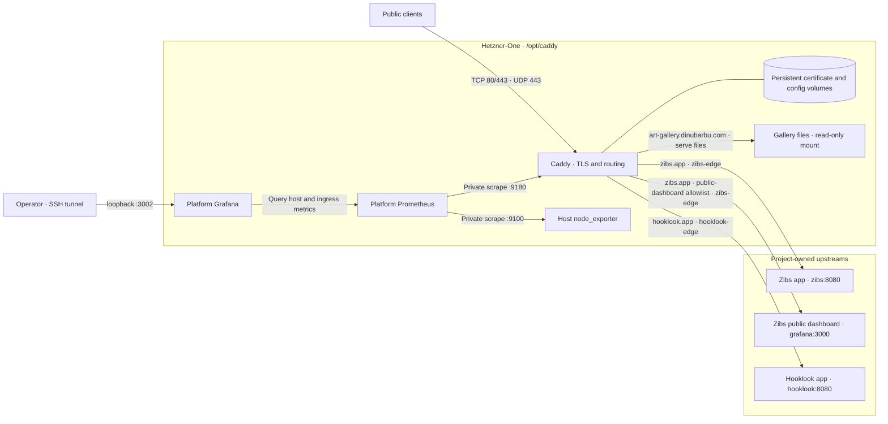

# Hetzner-One topology

Hetzner-One owns shared Caddy ingress, its public ports, certificate storage,
the `zibs-edge` and `hooklook-edge` Docker networks, and its platform monitoring. Upstream services run
on the same VPS and are deployed by their respective projects.

The diagram includes the prepared monitoring stack; its VPS rollout is pending.
Application observability remains outside this repository.

The Zibs dashboard appears only as a reverse-proxy destination. Its server and
configuration belong to Zibs. Caddy exposes only the public-dashboard path
allowlist; private workspace and probe paths return 404.

Caddy serves the gallery directly from `/opt/art-gallery/public`, mounted at
`/srv/art-gallery`. Its persistent volumes are `zibs_caddy-data` and
`zibs_caddy-config`; their historical names are retained to preserve TLS state.

See the [Caddyfile](../Caddyfile) for routes and request limits,
[Compose configuration](../compose.yaml) for ports, mounts, and networks, and
[deployment runbook](deployment-runbook.md) for ingress operation.

Monitoring networking, retained state, and user-run rollout are documented in
the [observability runbook](observability-runbook.md).
