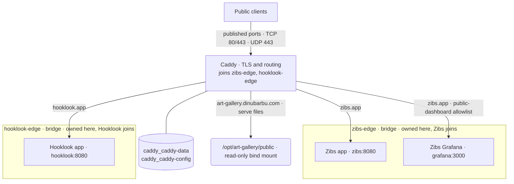
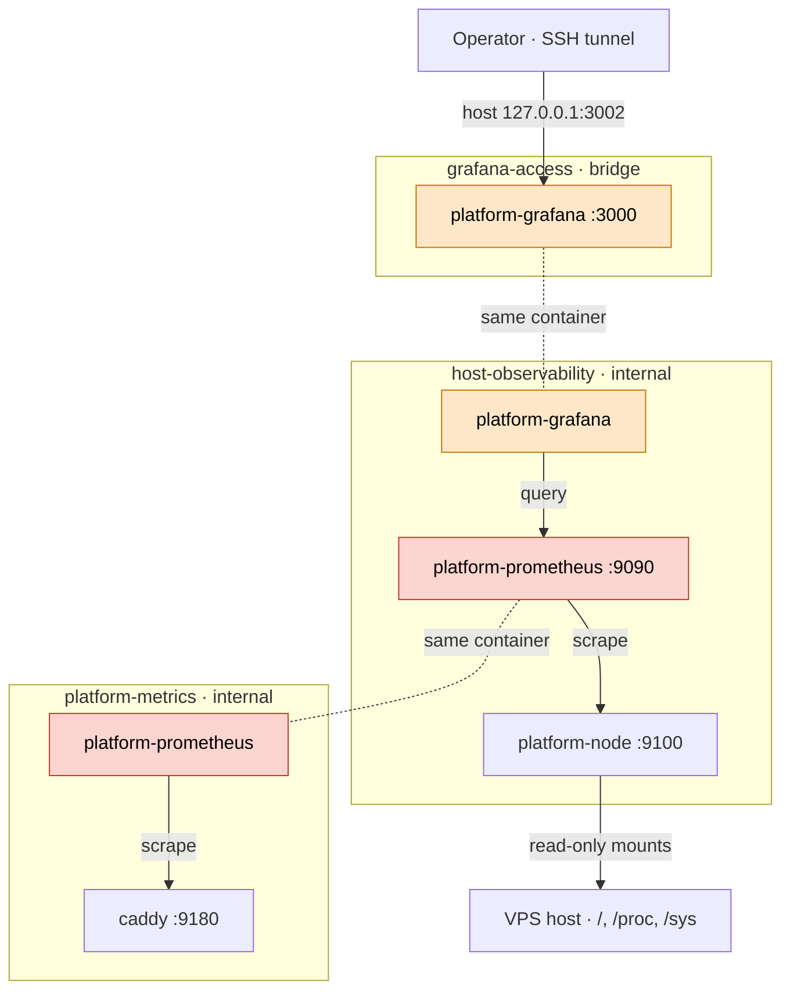

# Hetzner-One topology

Hetzner-One owns shared Caddy ingress, its public ports, certificate storage,
the `zibs-edge` and `hooklook-edge` Docker networks, and its platform monitoring. Upstream services run
on the same VPS and are deployed by their respective projects,
[zibs](https://github.com/dvinubius/zibs) and
[Hooklook](https://github.com/dvinubius/hooklook).
Application observability remains outside this repository.

## Ingress

Boxes are Docker networks. Caddy spans both edge networks, so it sits outside
them; each upstream is reachable from Caddy only over the network it shares.

| Port | Listener | Bound to | Reachable from | Purpose |
| --- | --- | --- | --- | --- |
| 80/tcp | Caddy | Host, all interfaces | Public | HTTP-to-HTTPS redirects and ACME HTTP-01 |
| 443/tcp | Caddy | Host, all interfaces | Public | HTTPS for all three hostnames |
| 443/udp | Caddy | Host, all interfaces | Public | HTTP/3 |
| 2019/tcp | Caddy admin API | Container loopback | Inside the Caddy container only | Configuration API; never published or routed |
| 8080/tcp | Zibs app (Zibs-owned) | `zibs-edge` | Containers on `zibs-edge` | `zibs.app` upstream |
| 3000/tcp | Zibs Grafana (Zibs-owned) | `zibs-edge` | Containers on `zibs-edge` | Public-dashboard allowlist upstream |
| 8080/tcp | Hooklook app (Hooklook-owned) | `hooklook-edge` | Containers on `hooklook-edge` | `hooklook.app` upstream |

The Zibs dashboard appears only as a reverse-proxy destination. Its server and
configuration belong to Zibs. Caddy exposes only the public-dashboard path
allowlist; private workspace and probe paths return 404.

Caddy serves the gallery directly from `/opt/art-gallery/public`, mounted at
`/srv/art-gallery`. Its persistent volumes are `caddy_caddy-data` and
`caddy_caddy-config`, external to Compose to protect TLS state.

See the [Caddyfile](../Caddyfile) for routes and request limits,
[Compose configuration](../compose.yaml) for ports, mounts, and networks, and
[deployment runbook](deployment-runbook.md) for ingress operation.

## Observability

Boxes are Docker networks. A container attached to several networks appears
in each network's box, colored alike and joined by a dotted line; every solid
edge is traffic over the network whose box contains it.

| Port | Listener | Bound to | Reachable from | Purpose |
| --- | --- | --- | --- | --- |
| 3002/tcp | Platform Grafana (container :3000) | Host `127.0.0.1` via `grafana-access` | Host loopback, so SSH tunnel only | Operator dashboards; login required |
| 3000/tcp | Platform Grafana | `host-observability`, `grafana-access` | Monitoring containers | Grafana UI and API behind the loopback publication |
| 9090/tcp | Platform Prometheus | `host-observability`, `platform-metrics` | Monitoring containers and Caddy | Grafana datasource; not published |
| 9100/tcp | Platform node_exporter | `host-observability` | Monitoring containers | Host metrics scrape; not published |
| 9180/tcp | Caddy metrics listener | `platform-metrics`, `zibs-edge`, `hooklook-edge` | Prometheus and trusted edge-network containers | Caddy metrics scrape; not published, not an admin API |

`host-observability` and `platform-metrics` are internal networks without
outbound access. `grafana-access` is a non-internal bridge that exists only so
Docker can publish Grafana on host loopback. Neither Prometheus nor
node_exporter joins an application edge network.

Monitoring networking, retained state, and user-run operation are documented in
the [observability runbook](observability-runbook.md).
